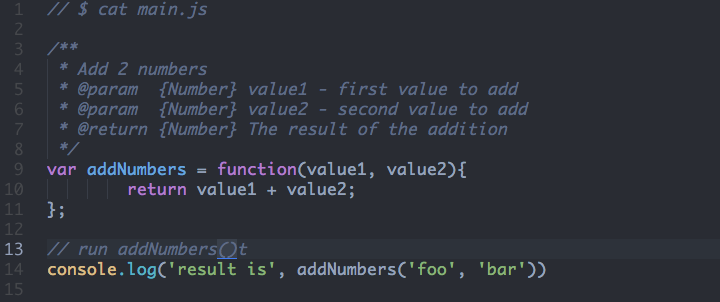

title: Why Using jsdoced Javascript?
output: index.html
theme: jdan/cleaver-retro
--

# Why Using jsdoced.js ?
## From a CTO Point of View

--

## First a little intro

--

### What is jsdoced javascript

- it is a javascript to javascript compiler 
- it reads javascript + jsdoc 
- it add strong type checking to your code

--

## Steps by Steps

--

### Take javascript + jsdoc



--

### Compile it

```
$ # install the compiler
$ npm install jsdoced.js
$
$ # compile your source
$ jsdoced.js --node main.js -o main.jsdoced.js
```
--

### Run it

jsdoced javascript detects the error

```
$ node main.jsdoced.js
arguments 1 is a string and should be a number
arguments 2 is a string and should be a number
result is a string and should be a number
```

Plain javascript silently ignore it

```
$ node main.js
result is foobar
```
--

### So... What is jsdoced javascript

It tests your javascript with jsdoc

--

## So ...

# Why Using jsdoced.js

## From a CTO point of view

--

### Why Using jsdoced.js ?

- It adds dynamic type checking to javascript
- It tests your js with jsdoc
- It detects new family of errors
- It is painless to integrate, and more

For more, see [jsdoced.js site](http://jsdocedjs.org)

--

### From a CTO Point of View ?

Here CTO is short for a personn

- Using a large code base
- Responsible to keep it running over time
- Taking decision that impact a team of devs

--

## So why a cto would use jsdoced.js ?

--

## Because jsdoced.js is

# Easy To Learn

--

### You know javascript

```
var addNumbers = function(value1, value2){
        return value1 + value2;
};
```

[javascript](http://en.wikipedia.org/wiki/JavaScript)

--

### You know jsdoc

```
/**
 * Add 2 numbers 
 * @param  {Number} value1 - first value to add
 * @param  {Number} value2 - second value to add
 * @return {Number} The result of the addition
 */
```

[jsdoc](http://usejsdoc.org)

--

### So you know jsdoced.js

Here is some jsdoced.js. Sound Familiar, no ?


```
/**
 * Add 2 numbers 
 * @param  {Number} value1 - first value to add
 * @param  {Number} value2 - second value to add
 * @return {Number} The result of the addition
 */
var addNumbers = function(value1, value2){
        return value1 + value2;
};
```

[jsdoced.js](http://jsdocedjs.org) is just jsdoc + javascript

--

### jsdoced.js is easy to learn

- jsdoced.js is just 2 things: jsdoc + javascript
- you know javascript
- you know jsdoc


**So you already know jsdoced.js**

--

## Why Using jsdoced.js ?

--

## Because jsdoced.js is

# Painless to Integrate

--

### You keep your code

```
var addNumbers = function(value1, value2){
        return value1 + value2;
};
```

**You keep using javascript**

--

### You keep your docs

```
/**
 * Add 2 numbers 
 * @param  {Number} value1 - first value to add
 * @param  {Number} value2 - second value to add
 * @return {Number} The result of the addition
 */
```

**You keep using jsdoc**

--

### No Impact on Your Code Base

* You dont have to commit to jsdoced.js
* You can easily add/remove jsdoced.js
* It isn't like a new language

**jsdoced.js is painless to integrate**

--

## Why Using jsdoced.js ?

--

## Because jsdoced.js helps you

# Detect New Family of Errors

--

### New Family of Errors

* You already passed a **wrong type of argument** ?
* or set **wrong type in a property** ?
* or called a **private function** where it shouldnt be ?

Plain Javascript silently ignore those error

**jsdoced.js warn you immediatly**

--

### Finding Bugs is Good

* Well, bugs aren't good news :)
* Better to find bugs before your user see them
* Bugs found early make them easier to fix

**jsdoced.js makes your code more stable**

--

## Why Using jsdoced.js ?

--

## Because jsdoced.js helps you

# Document your code

--

### Documenting code is good

- make your code base easier to learn
- good in a large team where people come and go
- developers dont like to write documentation

--

### jsdoced.js creates virtuous cycle

- Documenting doc is good for your devs
- Testing is good for your users

**The more you document your code**

**The safer it becomes**


--

# Check it out [jsdocedjs.org](http://jsdocedjs.org)
## by [Jerome Etienne](http://twitter.com/jerome_etienne)
